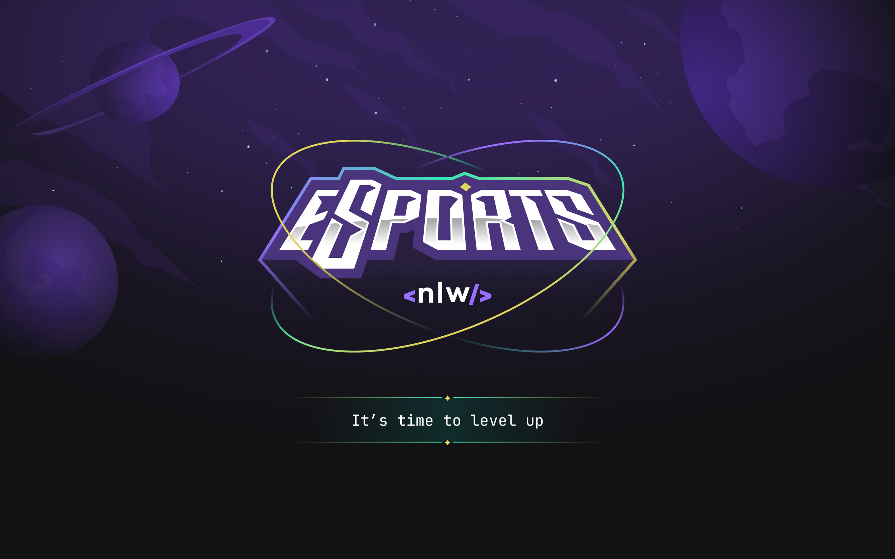

# NLW eSports

Sistema desenvolvido no NLW eSports.
Desenhado pela [RockeatSeat](https://www.rocketseat.com.br/) para o NLW eSports esse sistema possui um back-end em Node.js que integra web (React) e mobile (React Native) com o mesmo banco de dados, e serve para juntar pessoas que querem o duo ideal na hora da gameplay.

[Figma](https://www.figma.com/file/TYG12SIZtKp3uXvJfwdAbl/NLW-eSports-(Community)?node-id=6%3A23) do projeto 

## Linguagens e frameworks e Bibliotecas utilizados
 - [TypeScript](https://www.typescriptlang.org/)
 - [X] Back-end
 - - [Vite](https://vitejs.dev/)
 - - [NodeJS](https://nodejs.org/en/)
 - - [Prisma](https://www.prisma.io/)
 - - [SQLite](https://www.sqlite.org/index.html)
 - [X] Web
 -  - [X] [ReactJS](https://pt-br.reactjs.org/)
 -  - [Tailwind](https://tailwindcss.com/) 
 -  - [Express](https://expressjs.com/pt-br/)
 - [X] Mobile
 - - [X] [React Native](https://reactnative.dev/)
 -  - [phosphor](https://phosphoricons.com/)
 -  - [Radix UI](https://www.radix-ui.com/)


## Installation
Server
```
npm install
npx prisma init
npx prisma migrate dev
npx prisma studio
npm run dev
```

Web
```
npm install
npm run dev
```

Mobile
```
npm install
expo start
```

## Autor and Contact

<div> 
  <a href="https://www.linkedin.com/in/carlos-jose-design/" target="_blank">
    
  </a>

</div>

